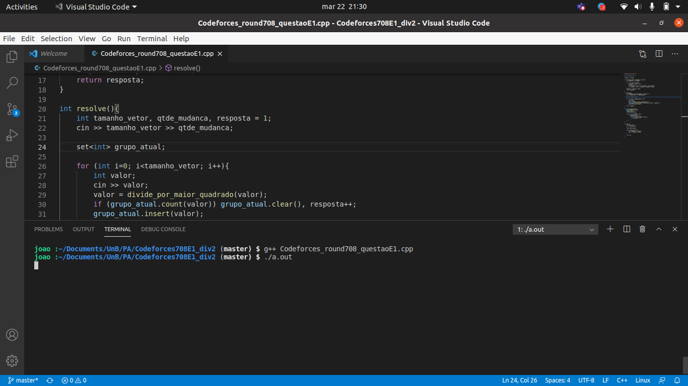
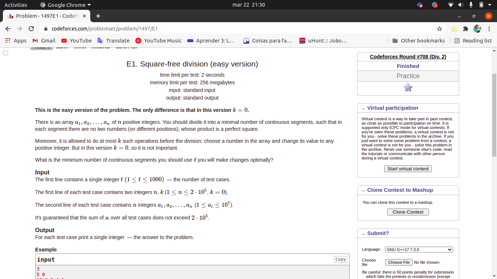
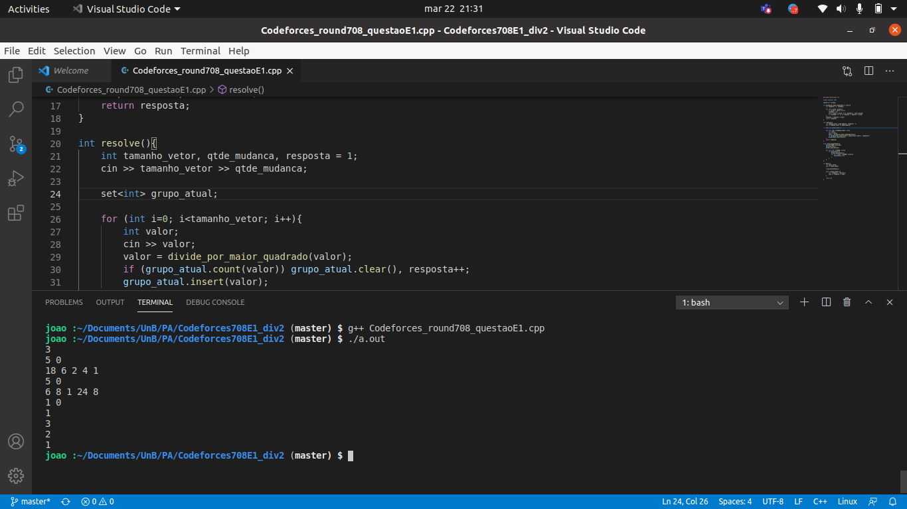

# Codeforces round 708 questão E1

**Número da Lista**: X<br>
**Conteúdo da Disciplina**: Greedy<br>

## Alunos
|Matrícula | Aluno |
| -- | -- |
| 18/0033743 | João Pedro Silva de Carvalho |
| 180028324 | Thiago Luiz de Souza Gomes | 


## Sobre 

É a resolução de uma questão de programação competitiva com o tema de algoritmos gulosos. Nós usamos a abordagens gulosa, com alguns incrementos de teoria dos números para poder utilizar a abordagem gulosa.

A ideia da questão é: Dado um vetor de tamanho n, qual o número mínimo de subsegmentos continuos em que esse vetor se divide sendo que em cada subsegmento não pode haver dois números em diferentes posições cujo produto resulte em um número quadrado perfeito. 

A aboragem gulosa não é tão obvia, mas analisando que os os divisores primos tem que ter expoentes pares na fatoração, podemos utilizar a abordagem gulosa sem problemas, nem de resultado e nem de complexidade.

O guloso dessa questão se baseia na ordem em que são lidos os numeros do vetor (que é a ordem do vetor do problema) e para cada número a gente faz apenas operação, em outras palavras, dada uma descisão, a gente não precisa retornar dela. 

## Screenshots
Adicione 3 ou mais screenshots do projeto em funcionamento.




## Instalação 
**Linguagem**: C++<br>
Basta apenas ter o G++ instalado na sua máquina. Na maioria dos computadores linux, ja vem instalado por padrão.

## Uso 
Com o G++ instalado basta rodar o seguinte comamndo para compilar:

``` Shell
g++ Codeforces_round708_questaoE1.cpp
```

Para rodar basta colocar seguinte comando:
``` Shell
./a.out
```
